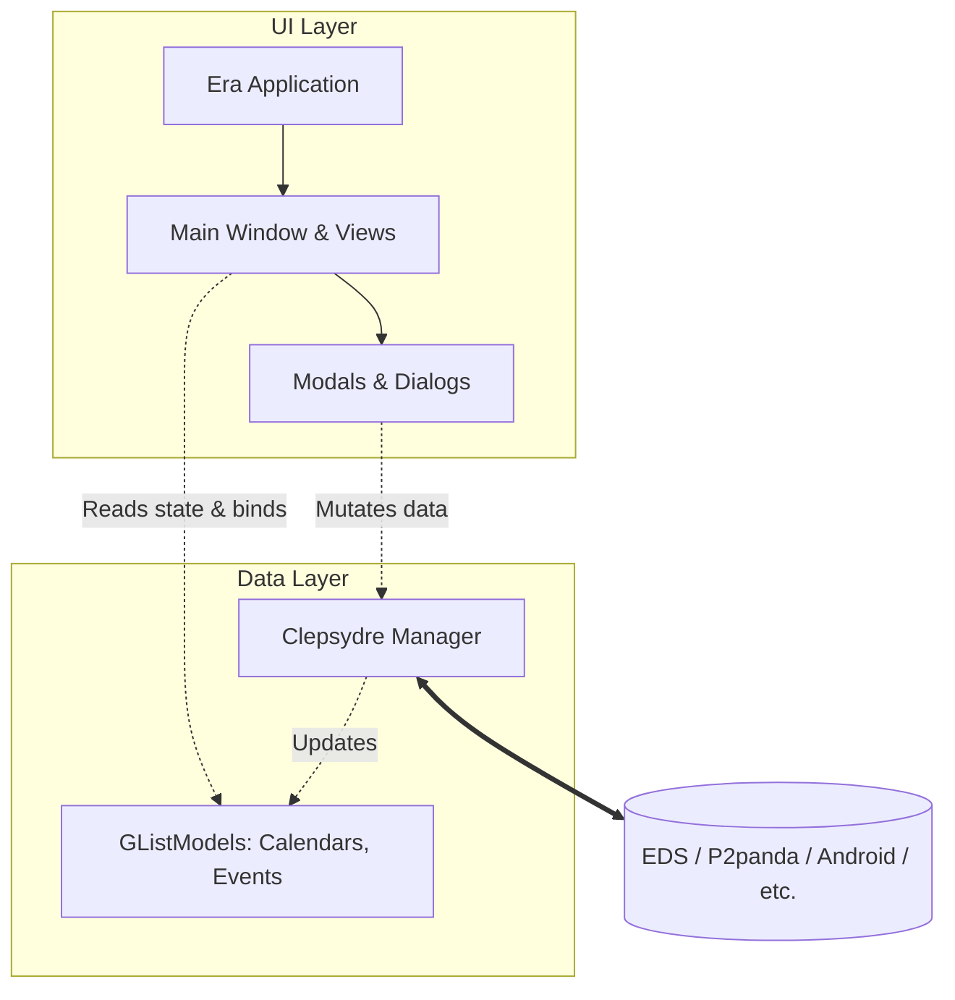

# Contributing to Era

This document describes the high-level architecture of Era for contributors. The documentation has been decentralized into the modules they describe to keep information close to the code.

For specific details on UI components, views, or dialogs, follow the links in the **Project Layout & Documentation Index** below.

This documentation was Ai-generated and human-reviewed. It might not be always kept up-to-date.

---

## Table of Contents

- [Overview](#overview)
- [Architecture](#architecture)
- [Tech Stack](#tech-stack)
- [Building](#building)
- [Project Layout & Documentation Index](#project-layout--documentation-index)

---

## Overview

Era is a GTK 4 / libadwaita calendar application written in Rust. It is **backend-agnostic**: all calendar data access goes through [Clepsydre](https://gitlab.gnome.org/TitouanReal/clepsydre), a GObject-based abstraction layer. While you might commonly see it used with the EDS (Evolution Data Server) backend, it is designed to seamlessly swap to other Clepsydre implementations (e.g. `clepsydre-p2panda`, `clepsydre-android`, or `ccmd`). Switching the backend is a one-line change in `application.rs`.

Era uses Clepsydre as a **view-model**. The UI is reactive on the data Clepsydre exposes (GObject properties, list models, signals). User actions (creating events, managing calendars, searching…) are forwarded to Clepsydre which talks to the actual backend.

## Architecture

At a high level, the application strictly separates the UI layer from the data layer via Clepsydre.



## Tech Stack

| Layer | Technology |
|---|---|
| Language | Rust (edition 2024) |
| Toolkit | GTK 4 (≥ 4.20), libadwaita (≥ 1.8) |
| View-model | Clepsydre (+ clepsydre-eds, clepsydre-p2panda, etc.) |
| Build system | Meson (project) + Cargo (Rust) |
| Task runner | [just](https://github.com/casey/just) |
| UI templates | Blueprint (`.blp` → compiled to `.ui` XML) |
| i18n | gettext |
| Date/time | jiff |
| Portals | ashpd |

## Building

### Installing Clepsydre locally

For native (non-Flatpak) development you need the Clepsydre C libraries installed on your system. The repo ships a `just` recipe that automates this:

```sh
just install-clepsydre
```

This reads the exact commit pinned in the Flatpak manifest (`build-aux/org.gnome.gitlab.TitouanReal.Era.Devel.json`), clones the Clepsydre repo, builds `libclepsydre` and `libclepsydre-eds` (or other backends) with Meson, and installs them under `/usr`.

### Flatpak (development)

The Flatpak manifest lives at `build-aux/org.gnome.gitlab.TitouanReal.Era.Devel.json`. It pulls libical, Evolution Data Server, and Clepsydre as module dependencies before building Era itself. Use GNOME Builder or `flatpak-builder` as usual.

### Native build

After installing Clepsydre:

```sh
meson setup builddir
meson compile -C builddir
```

## Project Layout & Documentation Index

The codebase is organized into modular directories. Use the links below to dive into the documentation for specific components:

- `src/`
  - `widgets/` - **[Core UI, Window, & Navigation](src/widgets/DOCUMENTATION.md)**
    - `views/` - **[Calendar Views (Year, Month)](src/widgets/views/DOCUMENTATION.md)**
    - `calendar_management_dialog/` - **[Calendar Manager](src/widgets/calendar_management_dialog/DOCUMENTATION.md)**
    - `search_dialog/` - **[Search Dialog](src/widgets/search_dialog/DOCUMENTATION.md)**
    - `components/` - **[Shared Components](src/widgets/components/DOCUMENTATION.md)**
  - `utils/` - **[Utility Modules & Macros](src/utils/DOCUMENTATION.md)**
