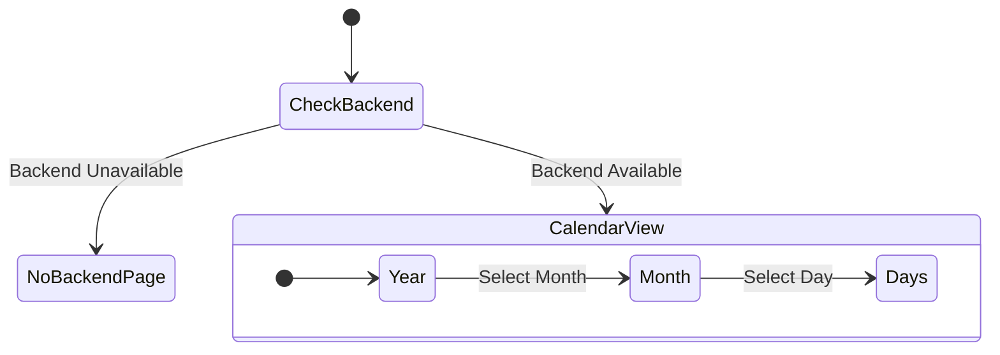

# Window, Navigation, and Core UI

This directory contains the core application window and high-level navigation structures.

## Overview

The `Window` (`window.rs`, template `window.blp`) is the main application window and serves as the root container for all calendar views and interactions.

### Architecture

## Window Layout & Breakpoints

The UI is highly adaptive. It uses `Adw.Breakpoint` to switch between two primary navigation paradigms depending on the window width:

1. **Wide Layout (Desktop)**
   - Uses an `Adw.OverlaySplitView` providing a sidebar on the left.
   - The main content area is an `Adw.ViewStack` with tabs for Year, Month, Week, Days, and Agenda.

2. **Narrow Layout (Mobile/Small Window)**
   - Uses a `Stack` that navigates linearly.
   - User drills down: **Year → Month → Days**.

## Navigation & Actions

The window declares global GActions that are accessible from anywhere in the application via keyboard shortcuts or buttons.

| Action | Shortcut | Effect |
|---|---|---|
| `win.search-events` | `Ctrl+F` | Opens `SearchDialog` |
| `win.manage-calendars` | `F8` / `Ctrl+Alt+M` | Opens `CalendarManagementDialog` |
| `win.create-event` | `Ctrl+N` | Opens `create_event_dialog.rs` |

## Sub-Modules

For more detailed information on specific areas, see their respective documentation:

- **[Views (Year, Month)](views/DOCUMENTATION.md)**
- **[Calendar Management Dialog](calendar_management_dialog/DOCUMENTATION.md)**
- **[Search Dialog](search_dialog/DOCUMENTATION.md)**
- **[Shared Components](components/DOCUMENTATION.md)**
