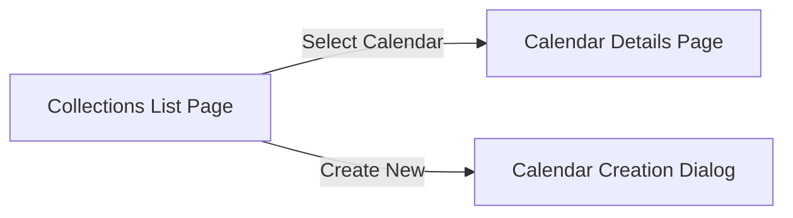

# Calendar Management Dialog

The `CalendarManagementDialog` (`src/widgets/calendar_management_dialog/`) handles the creation, editing, and deletion of calendars, grouped by backend collections.

## Navigation Structure

The dialog uses an `adw::NavigationView` to provide a drill-down interface:

### 1. CollectionsListPage
Lists all backend collections retrieved from the Clepsydre Manager.
- **`CollectionRow`:** Renders the collection name, a list of contained calendars (as `CalendarRow`s), and a "New Calendar" button.
- **`CalendarRow`:** Shows a calendar's color indicator, name, and a toggle for visibility. Toggling visibility calls `Calendar::try_set_visible_future`, replacing the color circle with a loading spinner while processing.

### 2. CalendarDetailsPage
Pushed when a user clicks on a specific `CalendarRow`.
- **Edit Name:** Provides an editable entry. Focus-out triggers `Calendar::try_set_name_future`.
- **Delete:** A remove button that triggers `Calendar::try_remove_future`. The dialog listens for the `removed` signal to automatically pop the page off the navigation stack.

### 3. CalendarCreationDialog
A smaller form opened directly from a `CollectionRow`.
- **Inputs:** Name entry and a `gtk::ColorDialogButton`.
- **Action:** Triggers `Collection::try_create_calendar_future`.
