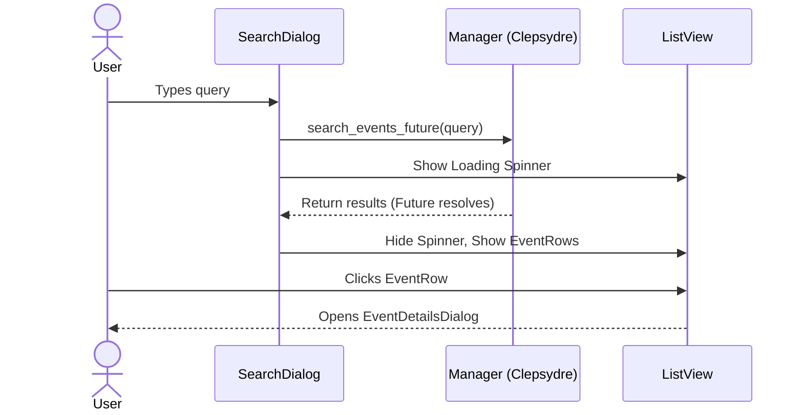

# Search Dialog

The `SearchDialog` (`src/widgets/search_dialog/`) allows users to query the backend for events matching a specific text string.

## Flow

1. **Input:** The user types into the search entry.
2. **Query:** The dialog calls `Manager::search_events_future` on the Clepsydre Manager.
3. **Loading State:** While the search is in flight, the dialog displays a loading spinner to indicate progress.
4. **Results:** Upon completion, the UI switches to a `gtk::ListView` of the results.

## Result Display

Each result is rendered using an `EventRow` component, which displays:
- The event's name.
- The start and end times.
- A color bar indicating the calendar to which the event belongs.

Clicking a result automatically opens the corresponding `EventDetailsDialog`.
