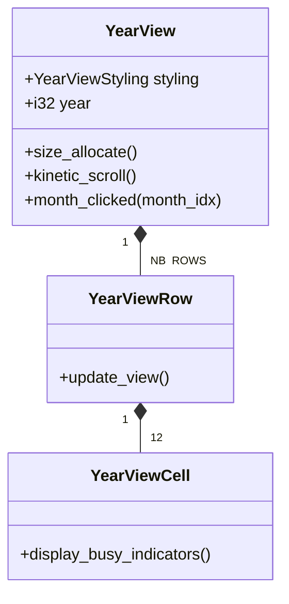

# Views (Year & Month)

This directory (`src/widgets/views/`) contains the custom widgets responsible for displaying the main calendar grids: `YearView` and `MonthView`.

## Shared Concepts

Both views implement **infinite scrolling** and **kinetic deceleration** manually, without relying on `gtk::ScrolledWindow`. This allows them to recycle a fixed number of rows (e.g., year rows or week rows) and seamlessly shift them to create the illusion of an infinite continuous calendar.

The views are highly adaptive and respond to window width changes (via `Adw.Breakpoint`) by exposing "Styling" enums (e.g., `YearViewStyling`, `MonthViewStyling`).

## Sub-Modules

- **[Month View](month_view/DOCUMENTATION.md)** - A highly complex view rendering continuous weeks, handling zooming, and placing multi-day events across grid boundaries.
- **[Year View](#year-view)** (documented below)

---

## Year View

The `YearView` (`year_view/mod.rs`) displays a vertical list of years. Each year is a `YearViewRow` containing 12 `YearViewCell`s (one for each month).

### Layout & Scrolling
- **Manual Allocation:** `YearView` acts as a custom container. In its `size_allocate` implementation, it manually places a fixed array of `YearViewRow` widgets.
- **Continuous Scrolling:** As the user scrolls up or down (via discrete scroll, kinetic swipe, or touchpad pan), the `YearView` updates a `scroll_offset`. Once the offset exceeds the height of a row, the top-most row is logically moved to the bottom (or vice-versa), its data is updated to the new year, and the offset wraps around.
- **Snapping:** Scrolling snaps to exact row boundaries when the scroll velocity drops below `VELOCITY_THRESHOLD_TO_SNAP`.

### Signals
- **`month_clicked(month_index: i32)`:** Emitted when a user clicks a `YearViewCell`. The main Window catches this signal to navigate to the `MonthView` for the selected month.

