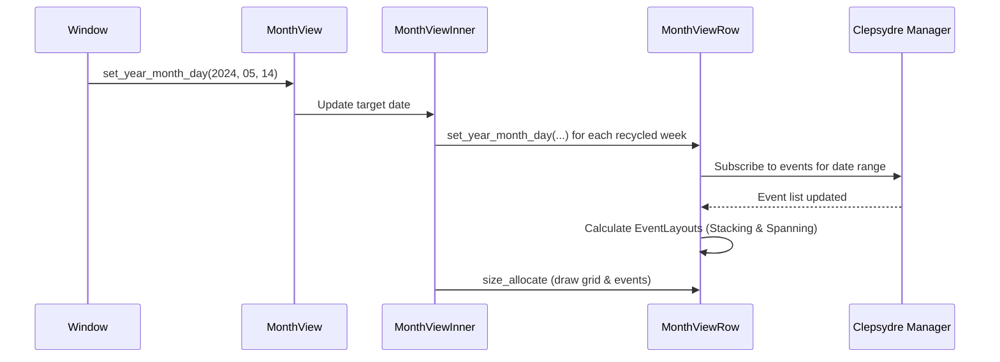

# Month View

The `MonthView` (`src/widgets/views/month_view/`) is a complex, custom-built calendar grid. Despite its name, it renders a continuous, infinite list of **weeks** (rows of 7 days).

## Architecture overview

Because the Month View requires zooming, kinetic scrolling, infinite week generation, and complex event layout, it is split into several components:

1. **`MonthView` (`mod.rs`)**: A `gtk::Box` wrapper. Exposes properties (`year`, `month`, `day`, `styling`) to the rest of the application and forwards them to `MonthViewInner`.
2. **`MonthViewInner` (`month_view_inner.rs`)**: The core scrollable container. Manages kinetic scrolling, zooming (scaling), and recycling week rows.
3. **`MonthViewRow` (`month_view_row.rs`)**: Represents a single week (7 days). Handles the layout of day cells, grid lines, and event widgets.
4. **`EventWidget` (`event_widget.rs`)**: Renders a single calendar event block.

---

## 1. Input Handling: Infinite Scrolling & Zooming (`MonthViewInner`)

`MonthViewInner` acts as a custom layout manager. It holds a fixed number of `MonthViewRow` widgets (enough to fill the screen plus a buffer above and below). Because it isn't using a standard `GtkScrolledWindow`, it relies heavily on custom Event Controllers and Gestures for input.

### Scrolling Gestures & Controllers
Instead of native GTK scrolling, it relies on several controllers to intercept scroll and touch events:
- **`EventControllerScroll (vertical | kinetic)`:** Handles continuous scrolling (like smooth mouse wheels or touchpads). Emits `scroll-begin`, `scroll`, and most importantly `decelerate` for kinetic momentum.
- **`EventControllerScroll (vertical | discrete)`:** Handles traditional discrete mouse wheels. When the `Ctrl` key is pressed, this is intercepted to trigger zooming instead of scrolling.
- **`GestureDrag` & `GestureSwipe` (touch-only):** Handle raw touchscreen drags and subsequent swipe flicks, respectively, to calculate touch-driven kinetic scrolling.

### Scrolling Logic
- **`scroll_offset`:** A state variable tracking the vertical translation in pixels.
- **Recycling:** During `size_allocate`, if `scroll_offset` pushes a row entirely out of view, that row is logically shifted to the opposite end of the list. Its assigned date is updated by ±7 days.
- **Kinetic Snapping:** Uses velocity thresholds (`kinetic_decelerate`). When scrolling slows down, the logic automatically snaps the final scroll position precisely to a week boundary.

### Zooming Gestures
The user can zoom in to make days taller (seeing more events at once) using:
- **`GestureZoom`:** For pinch-to-zoom on trackpads or touchscreens.
- **Ctrl + Scroll:** Via the discrete `EventControllerScroll`.
- **`EventControllerMotion`:** Tracks the pointer's coordinates so that zooming (scaling) remains centered on where the cursor is placed.

When zoomed, the `last_row_height` / `desired_next_row_height` are modified between `MINIMUM_ROW_HEIGHT` and `MAXIMUM_ROW_HEIGHT`. The allocation logic smoothly interpolates this height, resizing the day cells vertically without affecting the horizontal layout.

---

## 2. Row Layout (`MonthViewRow`)

A `MonthViewRow` represents one ISO week. It is a highly optimized custom widget that manually places its children via GTK's `size_allocate`.

### The Grid
To avoid creating 7 full sub-containers per week, the row draws its own grid lines. It creates standard GTK widgets for day labels (`header_1`...`header_7`) and places them across the top of the allocated area.

### Pointer Input (Clicks)
Day cells react to pointer input using **`GestureClick`**. Each of the 7 day cells in the `.blp` template has an attached `GestureClick` that, upon release, triggers a template callback (e.g. `$create_event_X`). This automatically prompts the creation of an event scoped to that specific day.

Similarly, **`EventWidget`** instances contain a `GestureClick` to trigger `$open_details`, loading the event details dialog.

### Event Layout & Spanning
1. **Data fetching:** The row subscribes to the Clepsydre `Manager` to fetch events for its specific date range (`day_boundaries_utc`).
2. **`SpannedEvent`:** Events are analyzed to determine their `column_start` (0-6) and `column_end` (1-7). 
3. **Stacking Algorithm (`EventLayout`):**
   - The row iterates through events, placing them into vertical "slots" (rows within the week row) so overlapping events do not visually collide.
   - If an event crosses the week boundary, it is drawn up to the edge. The next `MonthViewRow` will independently render the continuation of that event.
4. **Allocation:** In `size_allocate`, each `EventWidget` is positioned based on its column span and vertical slot.

### Overflow Handling
If overlapping events exceed the vertical space of a day cell, the row truncates the list and displays an `OverflowButton` (e.g., "+2 more").

---

## 3. Keyboard Navigation & Focus Input

To ensure full accessibility without native grid semantics, the Month View overrides GTK's default focus handling (`WidgetImpl::focus`).

### Internal Row Focus (`MonthViewRow`)
`MonthViewRow` builds a dynamic `focus_order` array (Day cells → Event widgets → Overflow buttons). 
- It maintains a `focus_index` to know exactly where the user is within the row.
- **Horizontal Navigation (Left/Right):** When horizontal arrow keys are pressed, the row intercepts the focus shift, calculates the `current_focus_column`, and manually sets focus to the cell at `col - 1` or `col + 1`.

### Vertical Navigation between Rows (`MonthViewInner`)
Vertical navigation requires moving focus from one week (row) to another while **maintaining the exact column state** (so pressing 'Down' on a Wednesday keeps you on Wednesday next week).
- When a user presses Up/Down, `MonthViewRow` determines it cannot move focus internally and passes the focus event up to the parent (`MonthViewInner`).
- `MonthViewInner` captures this in its own `focus()` override. It inspects which column the user was just in (by calling `focused_column()` on the current row).
- It then finds the adjacent `MonthViewRow` in the scroll view and explicitly sets focus to the matching column via `target_row.set_focused_column(col)`.

---

## Data Flow Summary

